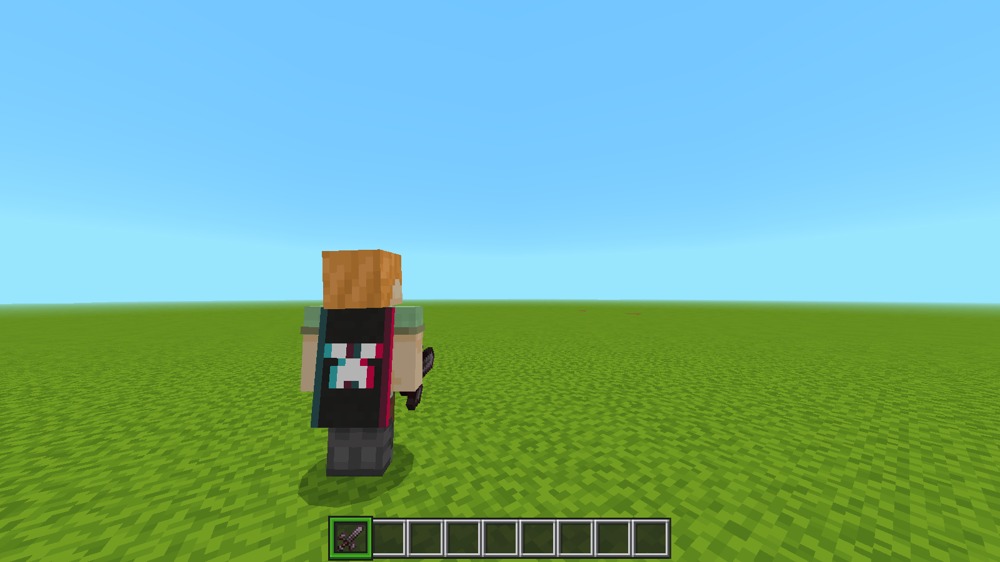
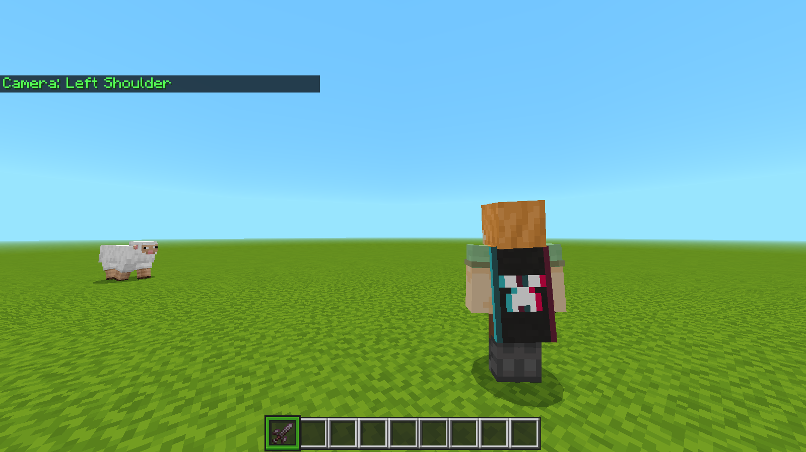

# Custom Cameras (Menu)

[](LICENSE)

Camera presets for **Minecraft Bedrock 26.50** — switched from an in-game menu or slash
commands, **without cheats**. Needs the world's camera experiment turned on; see
[Requirements](#requirements).

The menu opens by **holding Shift while standing still** (2s), from `/cameramenu:open`, or
by `/cameramenu:next` to cycle. All seven cameras are first-class: nothing here is
shoulder-only, the shoulder cameras are just the most usable ones.

Built and maintained entirely from the terminal: no GUI on the desktop, the menu lives
inside the game.

## In game

The two shoulder cameras are the same framing mirrored. Which one you pick decides which
side of the screen you end up on: over the **right** shoulder puts the camera to your right,
so you appear on the left of the frame.

| Over the right shoulder (`right`) | Over the left shoulder (`left`) |
|---|---|
|  |  |

## Cameras

| Camera | What it is | `/cameramenu:set` |
|---|---|---|
| Default | Back to first person | `default` |
| Left Shoulder | Over the left shoulder: the camera sits to your left, so you appear on the **right** of the frame (`view_offset [-1.2, 0]`, `radius 2.5`) | `left` |
| Center Shoulder | Same distance as the other shoulders, but directly behind you (no side offset) | `center` |
| Right Shoulder | Over the right shoulder: the camera sits to your right, so you appear on the **left** of the frame (`view_offset [1.2, 0]`) | `right` |
| Boom Shoulder | Built on `fixed_boom`: no orbit, no side offset, fixed distance | `boom` |
| Far | Distant third person (`radius 7`) | `far` |
| Low Cinematic | Low `minecraft:free` camera behind the player; resets itself after 3s | `low` |

## Commands

All of these work **without cheats** (`cheatsRequired: false`):

- `/cameramenu:open` — open the camera menu
- `/cameramenu:set <default|left|center|right|boom|far|low>` — switch directly
- `/cameramenu:next` — cycle through the persistent cameras
- `/cameramenu:reset` — back to default (the escape hatch)

The menu also opens on its own: hold **Shift while standing still** for 2 seconds, and move
to cancel the timer. (Holding shift is sneak, so Actions & Stuff's sneak animations will
play while you do it — that is the pack doing its job, not this one.)

The last camera you pick is reapplied when you re-enter the world. Switching does a quick
fade. The mod does **not** draw a crosshair: when the camera detaches from the player the
vanilla crosshair disappears, and that is expected.

## Requirements

1. The pack enabled on the world, under **Behavior Packs**.
2. **Experimental Creator Camera Features** on, under **World Settings → Experiments**.

The second one is not avoidable. The cameras are custom *camera presets*, and without that
experiment the game never loads them — the add-on would have nothing to switch to. It also
**disables that world's achievements permanently**, so this belongs on a world whose
achievements you do not mind spending, or on a world you make for it.

**Cheats are not required.** Every command is registered with `cheatsRequired: false` and
`permissionLevel: Any`, so `/cameramenu:*` works with `Allow Cheats: off`. Cheats and
experiments are separate switches and only the experiment is needed here; turning cheats on as
well would only cost the same world its achievements twice over.

### Achievements

Three things can take a world's achievements, and exactly one of them is worth losing sleep
over here:

- **Cheats.** Not needed, as above.
- **Any experiment.** Enabling one disables achievements for that world and it does not come
  back. The camera presets need `experimental_creator_cameras`, so this is the price of the
  add-on and there is no way around it — the one path that avoided it never rendered, below.
- **A pack with no add-on flag.** Nothing to do with experiments, and invisible in game:
  without `"metadata": { "product_type": "addon" }` in `manifest.json`, merely applying the
  pack makes the game treat the world as a cheat world and switch achievements off. This repo
  has it and the build refuses to package without it.

> Achievements also require **Survival mode**, so a world you play in creative has them
disabled no matter what any pack does.

### The script camera (kept but hidden)

There is a second way to move the camera in `scripts/main.js`: a `minecraft:free` camera
repositioned by the script every tick. It is the only path that needs no experiment, so it was
once the answer to all of the above — and in 26.50 it does not render:

- aiming it at the player collapses the view to first person, or to the ground;
- passing the player's rotation instead renders **no camera at all** — no error in the log,
  just sky.

So it is off, behind the `ENABLE_SCRIPT_PATH` flag in `scripts/main.js`: no menu entry, no
`/cameramenu:mode|tune|debug`, and no silent fallback that would trade a working native camera
for a broken one. Flip that flag to `true` to bring the whole path back if a future build
starts honouring the free camera — the code is otherwise intact. A world without the
experiment now says so in chat, instead of appearing to do something.

## Installation

### From a release `.mcaddon`

1. Grab `CameraMenu-v1.1.0.mcaddon` from the releases / `dist/`.
2. Double-click it (or open it with Minecraft) to import.
3. Enable it on the world under **Behavior Packs**.
4. Turn on **Experimental Creator Camera Features** under the world's **Experiments**, and
   leave cheats **off**. The experiment is what makes the presets load; cheats are not needed
   and would only add a second reason for that world to lose its achievements.

### Development install (what this repo does)

```bash
python3 build.py --install
```

That validates, packages into `dist/`, and copies the pack into
`development_behavior_packs/`, so a world sees it as a development pack and picks up
edits immediately.

## Repository layout

```
src/camera_menu_bp/        the behavior pack itself (this is what ships)
  manifest.json            UUIDs, modules, dependencies
  cameras/presets/*.json   one native camera preset per file
  scripts/main.js          menu, commands, fallback camera, persistence
  texts/*.lang             pack name / description (en_US, pt_BR)
build.py                   validate + package + install
build/brx.py               list the entries of a .brarchive (camera preset tables)
build/toggle_experiment.py enable/disable an experiment in a world's level.dat
build/nbt_experiments.py   read the 'experiments' compound back out of level.dat
build/make_icon.py         generate pack_icon.png with no dependencies
play.sh                    enable the experiment (needs --yes), then launch the game
tune.py                    calibrate shoulder camera framing + reinstall
ans_toggle.sh              A/B testing helper for a global resource pack
```

## Usage

```bash
python3 build.py            # validate + package dist/*.mcaddon
python3 build.py --install  # also install into the game
python3 build.py --icon     # (re)generate pack_icon.png
```

The build refuses to package unless the manifest, UUIDs, modules, dependencies, every
camera preset and both `.lang` files pass validation.

### Keeping the experiment on

The game clears the experiment flag every time it saves a world, so in practice it is a
per-session toggle. `play.sh` flips it in the worlds and then launches the game. That is the
part that makes the add-on work, and the same part that costs those worlds their achievements,
so it refuses to do anything without `--yes`. It also refuses to run while the game has a
world loaded, since the game would overwrite `level.dat` on save and lose the flag:

```bash
./play.sh                      # prints the warning and does nothing
./play.sh --yes                # every world (irreversible)
./play.sh "My World" --yes     # only that world (irreversible)
```

It detects a running game by reading `/proc/<pid>/comm`, so an open launcher does not
block it (in that case it just skips launching a second instance and waits for you).

<details>
<summary>Manual equivalent</summary>

```bash
python3 build/toggle_experiment.py "<world_dir>" experimental_creator_cameras on
```

A backup named `level.dat.camera-menu-backup` is written next to `level.dat` the first
time. Or enable it from the in-game UI: **World Settings → Experiments → Experimental
Creator Camera Features** (when the game itself writes it, it sticks).

</details>

## Tuning the cameras

The presets are files the game reads when the world loads, so tuning means rewriting them and
re-entering the world:

```bash
python3 tune.py            # show the current values
python3 tune.py --y 0.4    # raise the shoulder camera
python3 tune.py --y -0.2   # lower it
python3 tune.py --x 1.5    # push the player further to the side
python3 tune.py --radius 1.5  # move the shoulder cameras closer (smaller = tighter)
python3 tune.py --far 12   # distance of the far camera
```

`tune.py` rewrites the presets and reinstalls. Re-enter the world for the game to reload
them. You can also edit `cameras/presets/<name>.json` by hand and run
`python3 build.py --install`.

There used to be an in-game adjustment board (`/cameramenu:tune`). It could only ever drive the
script camera — a native preset is a file the game read at load and cannot be changed while you
play — so it went into hiding with that path. It is still in `scripts/main.js` behind
`ENABLE_SCRIPT_PATH`, along with the reason it became a board of buttons and not sliders: the
sliders in this client opened, but their handles would not move and the form submitted at the
minimum.

## How it works

The interesting parts are the schema rules that cost real debugging time to pin down.
They are enforced by the build validator so they cannot regress.

- **One object per file.** `minecraft:camera_preset` must be a single object `{...}` — an
  array is rejected with `minecraft:camera_preset: expected an object`.
- **Own namespace only.** Identifiers must stay in `cm:`; using `minecraft:*` makes the
  game discard the file.
- **The distance field is `radius`, and it only exists on `follow_orbit`.** It also
  requires `format_version: 1.21.90`. On `fixed_boom`, `radius` is accepted but
  **silently ignored** (the camera stays at the default 10).
- **`starting_radius` does not exist.** It is not part of the camera preset schema at
  all — the game logs `this member was found in the input, but is not present in the
  Schema` and drops the whole preset (`Failed to load camera presets`). This is the
  single most expensive mistake to make here.
- **`view_offset` and `entity_offset` only work on `follow_orbit`.** The 26.50 binary
  rejects them elsewhere with
  `Cannot use view_offset on a preset that is not a follow_orbit camera!` (same for
  `entity_offset`). `view_offset` is `[x, y]`: `x` pushes the player sideways, `y` is the
  height, where `0.0` is the vanilla default and the reference for "shoulder height".
- **Valid preset names in 26.50**: `first_person`, `third_person`, `third_person_front`,
  `free`, `fixed_boom`, `follow_orbit` (extracted from the vanilla `presets.brarchive` and
  the client binary). There is no `third_person_boom`.
- **The add-on flag is load-bearing.** `manifest.json` declares
  `"metadata": { "product_type": "addon" }`, and the validator fails the build without it.
  Since July 2025 this is what stops the game treating the pack as a cheat world and
  disabling achievements the moment it is applied.
- **No automatic fallback.** When a native preset fails to apply, the add-on does not quietly
  swap in the script camera: it puts the camera back to a defined state and says in chat that
  the world has no experimental camera presets, which is the actual problem. A silent fallback
  would only trade a working camera for a broken one.
- `scripts/main.js` uses `@minecraft/server 2.10.0` and `@minecraft/server-ui 2.2.0`. The
  menu uses literal strings instead of `RawMessage` because server-ui 2.x does not resolve
  nested messages. There is a safety latch that releases a player if a form never resolves.
- **The adjustment board uses buttons, not sliders.** Besides the 2.x signature change
  (`slider(label, min, max, options)` — the 1.x positional shape throws
  `Incorrect number of arguments to function. Expected 3-4, received 5`), the sliders
  themselves misbehaved in this client: handles that would not move and values submitted at
  the minimum. Buttons avoid the whole class of problem, and each click re-applies the camera
  so the effect is visible immediately.
- **English is the default locale.** The script only switches to Portuguese for `pt*`
  locales; any unrecognised locale falls back to English.
- Automatic triggers: **Shift is enabled** — hold it while standing still for 2s and the
  menu opens (moving restarts the timer). The spyglass trigger (`ENABLE_SPYGLASS_TRIGGER`)
  is off; `/cameramenu:open` replaces it.
- **The hidden script camera aims at the player.** `facingLocation: player.getHeadLocation()`
  is what puts the player in frame; the documented alternative,
  `rotation: player.getRotation()`, rendered no camera at all in 26.50. Neither is offered now,
  but those two facts are where anyone who tries the path again should start.
- **The hidden script camera was smoothed through `easeOptions`** (`{ easeTime: 0.05,
  easeType: "linear" }`), because re-positioning a camera once per tick makes the picture step
  a whole tick of movement at a time. Noted here because it is the first thing to try again if
  the path comes back.
- **The hidden fallback camera had velocity feed-forward.** A plain `c + (t-c)*0.35` lerp
  trails the player by `v/0.35` blocks — about 0.62 walking and 1.55 flying in creative, which
  is the "drag" people notice. The loop aimed `1/0.35` ticks ahead to cancel that steady-state
  error, and snapped instead of lerping when the gap passed 4 blocks (teleports).
- The Low Cinematic camera is intentionally temporary: it does not persist across sessions.
  It is also **unverified since the free-camera calls turned out not to render** — it uses the
  same `setCamera("minecraft:free", {...})` form as the hidden script path, so it may do
  nothing. It is still offered only because it was never part of the failure report; if it
  turns out to be dead too, it should go the same way as the rest of the path.
- **The camera is put on hold in a few contexts** (sleeping, riding a boat/minecart/mob, or
  gliding) and restored when you leave them. The check runs every 0.5s inside a `try/catch`,
  so if a property is ever unavailable the camera is left alone rather than suspended on a
  guess.
- **Dying no longer loses your camera.** Joining and respawning share one restore path, so the
  camera you had before dying is reapplied a few ticks after you are back.
- **The last camera is per player and per world**, in the `cm:preset` dynamic property. The
  `cm:tune:*` and `cm:script_mode` properties are only written by the hidden script path, and
  `/cameramenu:reset` clears them.

## Troubleshooting

**Nothing happens on a world, and chat says it has no experimental camera presets.** The
experiment is off for that world. Turn on **Experimental Creator Camera Features** in its
settings, or use a world where it is already on — the add-on needs it, and there is no path
that avoids it.

**Will the camera be choppy?** No. The presets are driven by the engine, so they move like
vanilla third person. The chop people noticed came from the hidden script path, which
repositioned the camera once per tick.

**My achievements are disabled and I never turned cheats on.** Two things do that: the world
has an experiment enabled, or the pack is missing the add-on flag. The manifest in this repo
has it (`metadata.product_type = "addon"`) and the build enforces it; if you copied the pack
out and edited its manifest, that is the line that went missing.

To check a world, read its `level.dat`:

```bash
python3 build/nbt_experiments.py "<world>/level.dat"
```

The `experiments` compound is the verdict. `experiments_ever_used: 1` (or
`saved_with_toggled_experiments: 1`) means the world has already been flagged and the game
will not give achievements back on its own, even after `experimental_creator_cameras` is
turned off. A world that never touched an experiment has those two at `0` and only behaves
that way — that is the one to build in if you want achievements.

**`Failed to load camera presets` in the content log.** A preset violated the schema.
Check the exact field name in the log; `starting_radius` is the usual suspect.

**Nothing happens at all, and there is no message either.** The pack has to be enabled under
**Behavior Packs** for that world. If it is enabled and there is still nothing, the world's
experiment is off — see the first entry in this section.

Always read the **newest** `ContentLog*.txt` rather than screenshots — old sessions mix
into screenshots and it is easy to chase an error that was already fixed. A session with
no `[Camera][error]` lines means the native presets loaded fine.

## Notes

- The world data lives under the launcher's Flatpak directory. `GAME_DIR` in `build.py`
  points at `~/.var/app/com.trench.trinity.launcher/...`; adjust it for other setups.
- `ans_toggle.sh` is only a testing helper for isolating a *global* resource pack
  (Actions & Stuff) when diagnosing animation/camera interference. It is not needed for
  the add-on to work.
- `level.dat` has the header `[int32 storage version][int32 payload length]`. Getting those
  two swapped still lets the file parse, so this is worth remembering if you touch the NBT
  tooling.

## License

[MIT](LICENSE).
